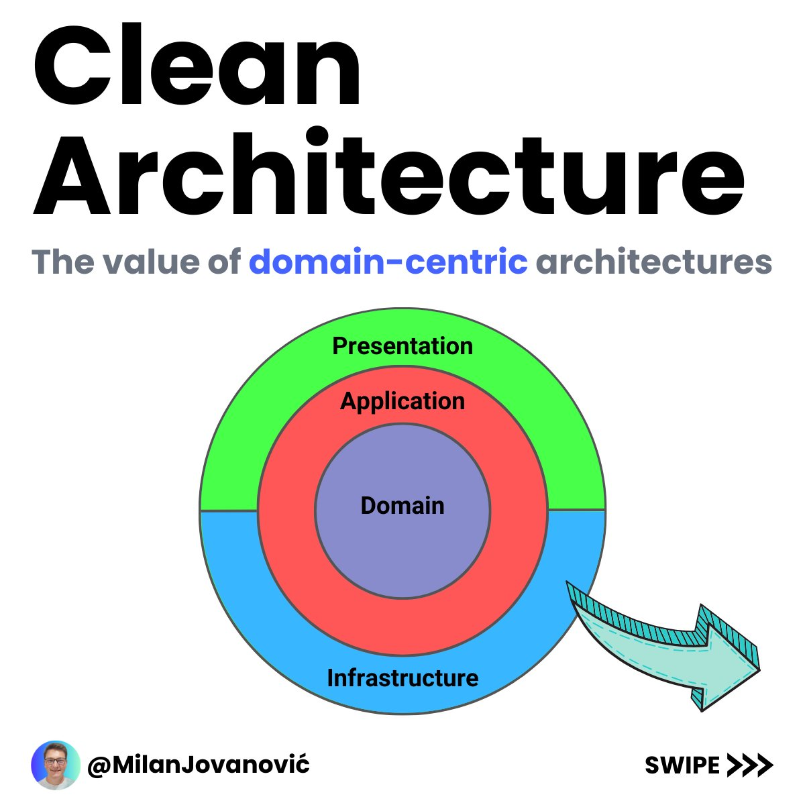

# Simple todo App Written using clean Architecture

## Description

This app is engineered by me and uses some of the best design methods(Industrial standards). With nodejs backend for todo storage, am
really excited that i built both the front and backend on my own.

### Features

- **Clean Architecture init**
- **Dependency injection init**

Disclaimer !! Not a cool UI but the logic is stunning...

.
